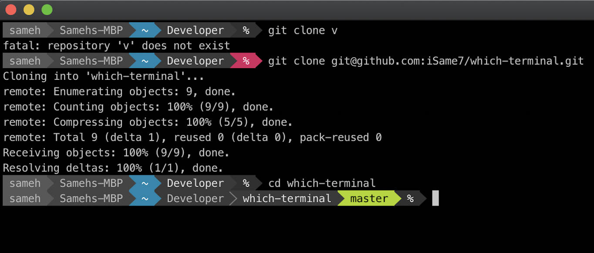
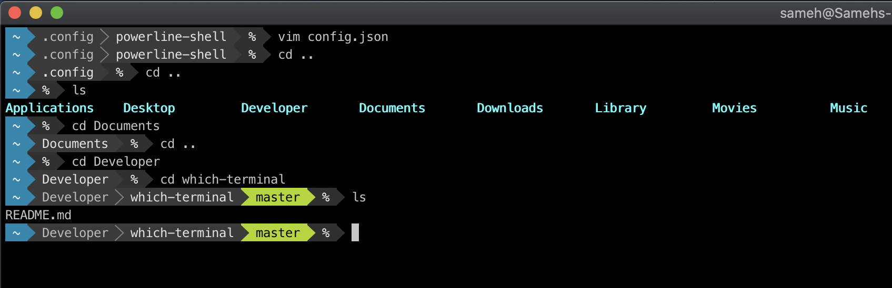

# which-terminal

Configuring the terminal I use

- I use [iTerm2](https://www.iterm2.com/) instead of the Stock terminal Mac app
- I use [oh-my-zshell](https://github.com/robbyrussell/oh-my-zsh)
- I use [Solarized Dark](http://ethanschoonover.com/solarized) for the terminal colors
- I use [powerline-shell](https://github.com/milkbikis/powerline-shell) to get those cool path bars. I usually hide the host name and the user, before running `python ./setup.py install`, edit the config file and comment out `username`, `hostname` [check the docs](https://github.com/b-ryan/powerline-shell#customization) and [this](https://askubuntu.com/questions/1063344/get-rid-of-name-and-hostname-in-a-terminal-prompt)
- I use the [Meslo Powerline Font](https://github.com/powerline/fonts/blob/master/Meslo%20Slashed/Meslo%20LG%20M%20Regular%20for%20Powerline.ttf) as you need a font that supports the directory characters for `powerline`
- I use [z](https://github.com/rupa/z) an amazing tool to quickly jump between projects. Like Alfred but for your Terminal reduced to folder search only
- I use the `subl .` command a lot to quickly open a specific folder in Sublime Text.
- Settings -> Profiles -> Keys -> Load Preset -> Natural Text Editing
- Enable the Show proxy icon in window title bar option to show the folder on the window title bar for right click and drag & drop gestures
- Profiles -> Advanced -> Semantic History -> Open with editor... -> Sublime Text 3
- Keys -> Replace Cycle Tabs ... with Next Tab and Previous Tab

Copied from [KrauseFx](https://github.com/KrauseFx/what-terminal-is-felix-using)
